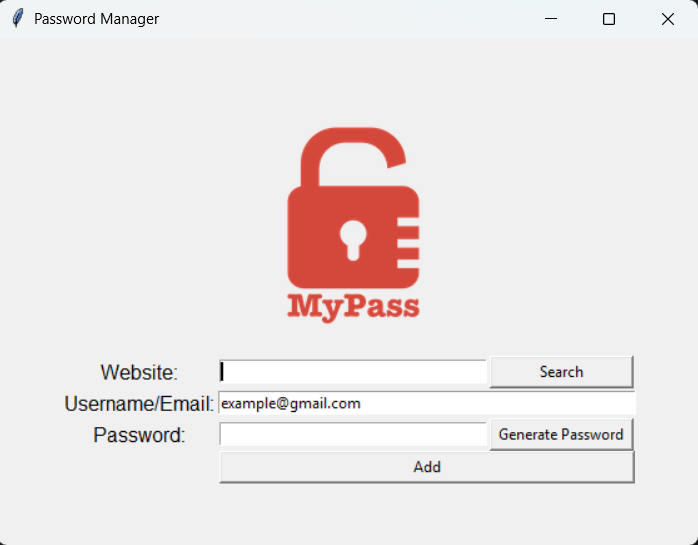

# 🔒 Password Manager App in Python (Tkinter)

A simple **Password Manager** built using Python's `tkinter` module.  
Features password generation, storage, and retrieval.

---

## 🛠️ Technologies Used

- Python 3.11
- Tkinter (GUI)
- pyclip (copy password to clipboard)
- json (data storage)
- Docker (optional containerization)

---

## 🚀 Features

- Generate strong random passwords
- Save passwords securely in a JSON file
- Search for saved passwords by website
- Copy passwords to clipboard
- Simple GUI with Tkinter

---

## 📂 Project Structure
```bash
password-manager/
│
├── main.py
├── logo.png
├── requirements.txt
├── Dockerfile
├── docker-compose.yml
└── README.md
```

---

## ▶️ Run Locally (Recommended)

```bash
git clone https://github.com/Fayyaz6137/Password_Manager.git

cd password-manager

pip install -r requirements.txt

python main.py
```

---

## 🐳 Run With Docker

```bash
docker compose up --build
```
⚠️ Since this is a GUI application, running inside Docker requires an X server (e.g., VcXsrv on Windows).

---

## 🖼️ Game Screenshot

